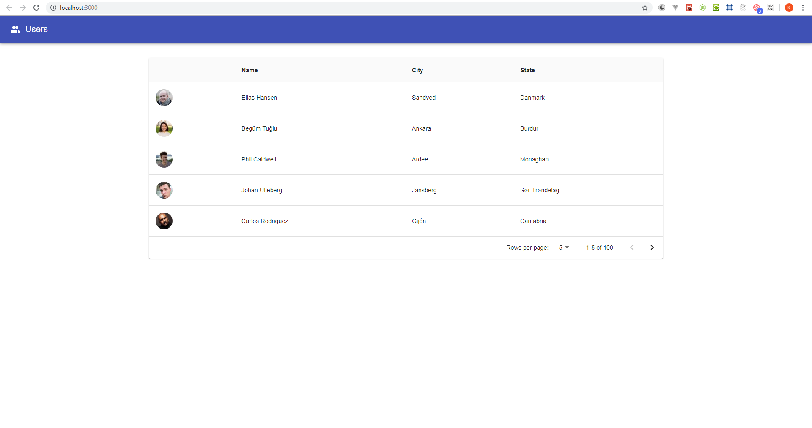

# simplibuild-ketan-test

### Checkout to rendering-branch after cloned the repository
`git checkout -b rendering-engine`

### Install required dependencies
`npm install`

or

`yarn install`

### Run the application
`npm start`

or 

`yarn start`

The application will run at [http://localhost:3000](http://localhost:3000) after running `npm start`

### Generate build

`npm run build`

or

`yarn build`

-------

### Repository Structure

- `public` : Contain `index.html` and other public assets like css, images, etc...
- `src`
  - `actions` : List of the actions used by redux
  - `components` : Custom application components  
    - `TopBar` : Page Header
    - `Users` : Users List
  - `config` : Environment configurations
  - `reducers` : List of reducers used by redux
  - `services` : API services
  - `store` : Application / Redux store configurations
  - `App.js` : Application bootstrap component
  - `index.js` : Responsible to start the application with application level store
  - `serviceWorker.js` : Service worker
- `package.json` : Managing dependencies and scripts to run the application

-------

### Application Preview

